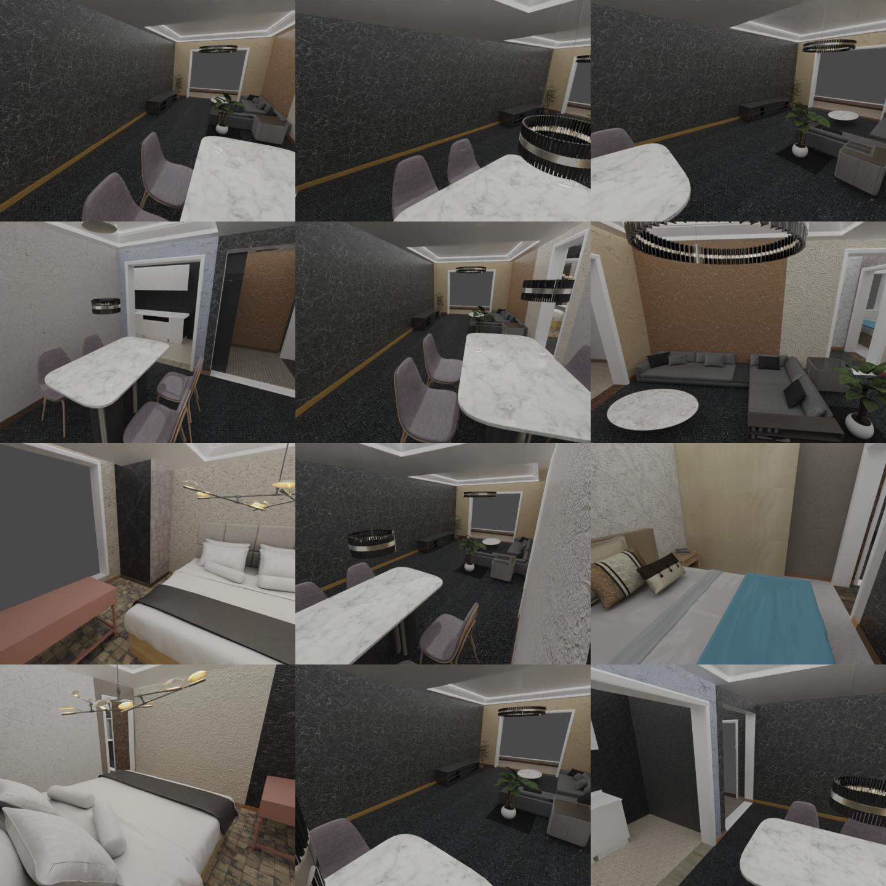
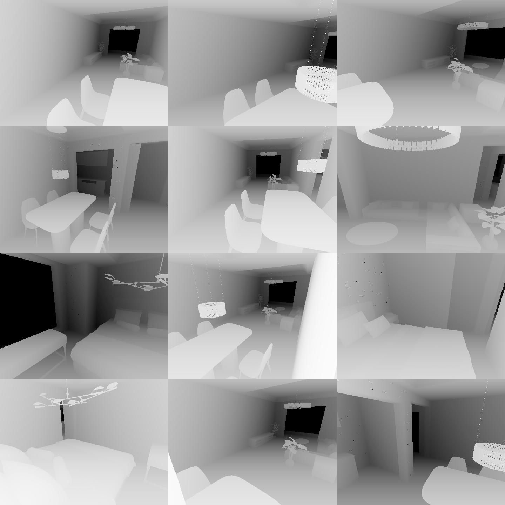
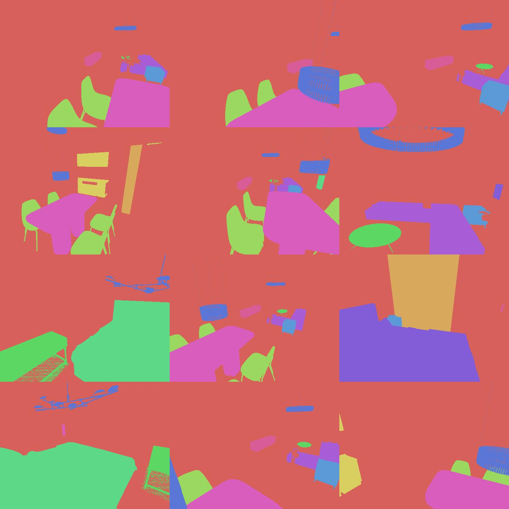
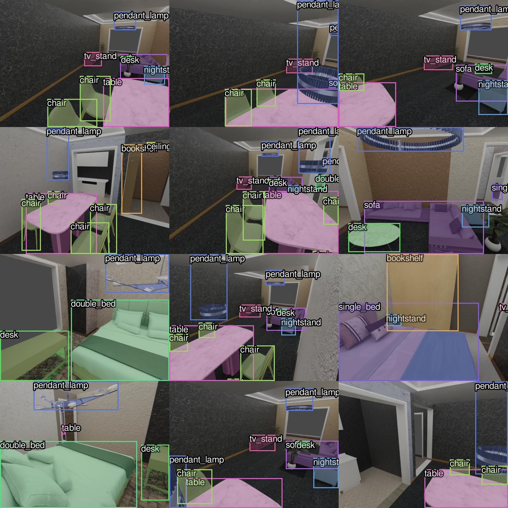
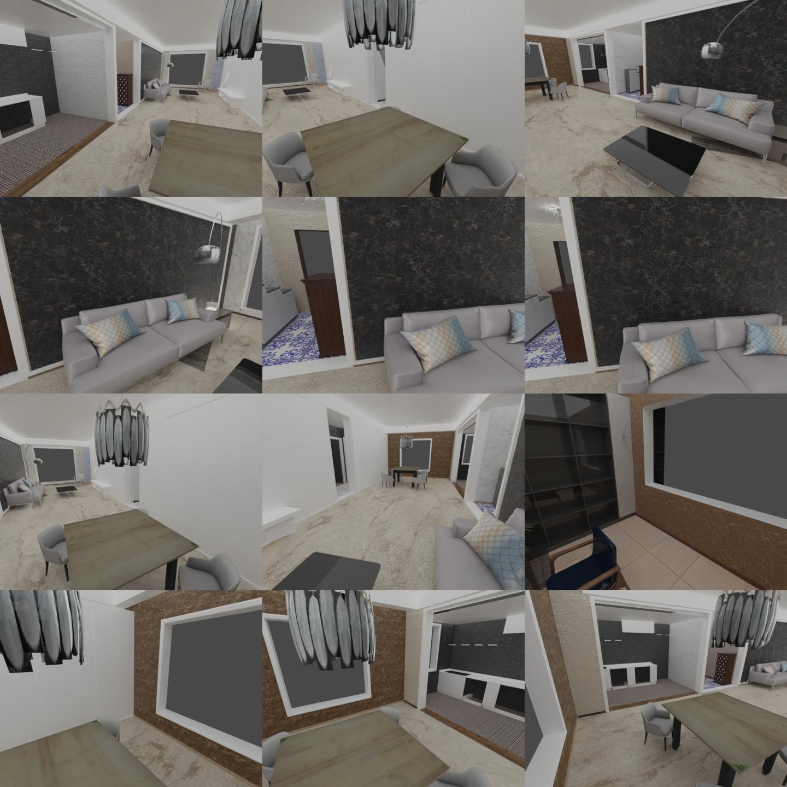
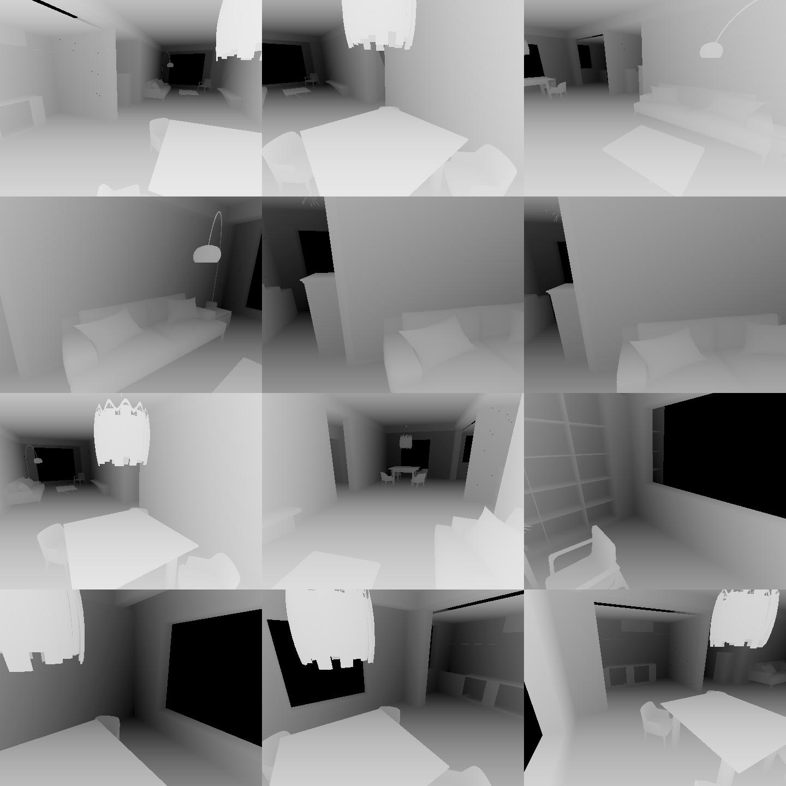
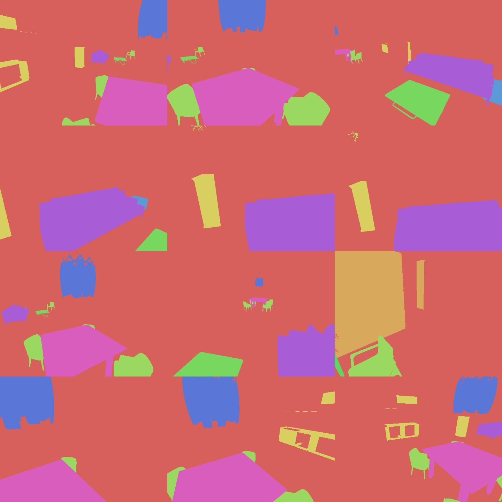
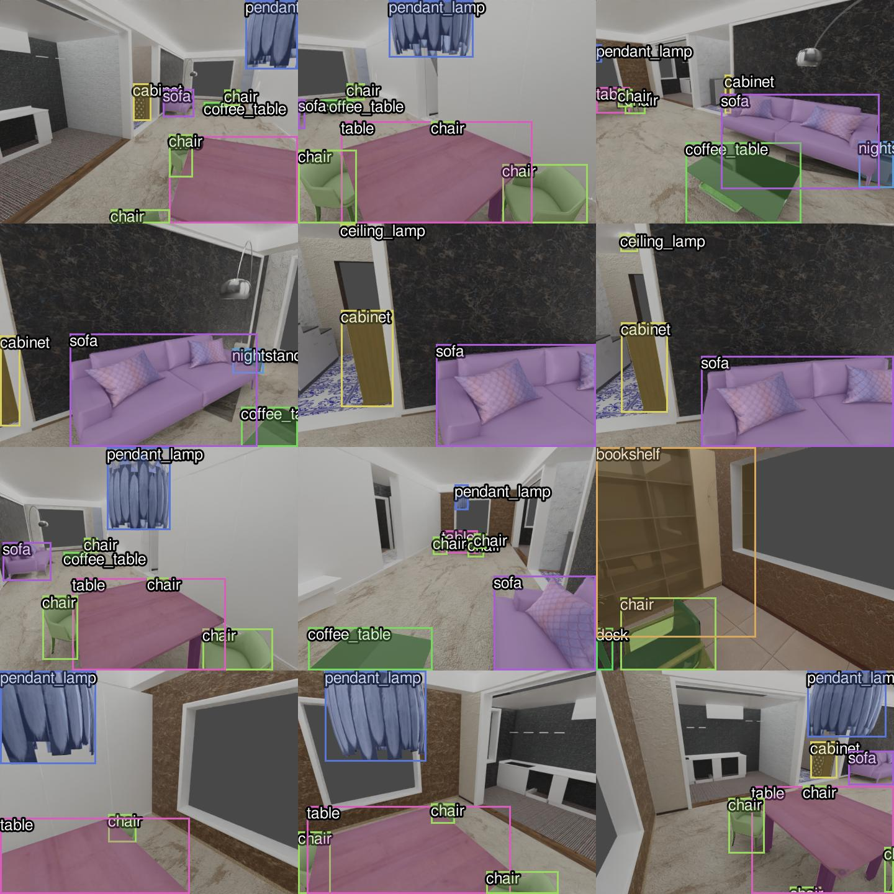

# BlenderProc2 for 3D-Front
Support BlenderProc2 with **multi-GPU batch rendering** and **3D visualization** for the 3D-Front dataset.

If you feel struggled in rendering 3D-Front or visualizing its 3D assets for your tasks. Here is a solution based on [BlenderProc2](https://github.com/DLR-RM/BlenderProc) and [VTK](https://vtk.org/).

#### 2D rendering
|                                 RGB                                 |                                Depth                                |                             Semantics                             |                             Instances                              |
|:-------------------------------------------------------------------:|:-------------------------------------------------------------------:|:-----------------------------------------------------------------:|:------------------------------------------------------------------:|
|  |  |  |  |
|  |  |  |  |


#### 3D visualization
|                                Pointcloud                                |                          Layout & Camera Poses                           |                 CAD models + Oriented Bounding Boxes                 |
|:------------------------------------------------------------------------:|:------------------------------------------------------------------------:|:--------------------------------------------------------------------:|
|  |  |  |
|  |  |  |

*Note*:
* X server is required for 3D visualization only (i.e., You can render on a remote headless server, then visualize the 3D contents interactively with your local machine).
* [OpenGL camera setting](http://www.songho.ca/opengl/gl_camera.html) is used.


Please check the orginal [REAME](README_BlenderProc2.md) if you want to know all the functions in BlenderProc2.

---

### Install
1. Use [conda](https://docs.conda.io/en/latest/miniconda.html) to deploy the environment by
    ```commandline
    cd BlenderProc-3DFront
    conda env create -f environment.yml
    conda activate blenderproc
    pip install -e .
    ```

2. Apply for the [3D-Front dataset](https://tianchi.aliyun.com/specials/promotion/alibaba-3d-scene-dataset). Download all the data and link them to the local directory as follows:
    ```
   examples/datasets/front_3d_with_improved_mat/3D-FRONT
   examples/datasets/front_3d_with_improved_mat/3D-FRONT-texture
   examples/datasets/front_3d_with_improved_mat/3D-FUTURE-model
    ```
   Move our improved 3D-Future `model_info.json` to the `3D-FUTURE-model` folder by
   ```
   mv examples/datasets/front_3d_with_improved_mat/model_info_revised.json examples/datasets/front_3d_with_improved_mat/3D-FUTURE-model
   ```
   
3. Download textures data from [link](https://ambientcg.com/) by
   ```commandline
   blenderproc run blenderproc/scripts/download_cc_textures.py ./resources/cctextures
   ```

---
### Render
Since I use Ubuntu system, BlenderProc will automatically install [blender-3.0.0-linux-x64](https://download.blender.org/release/Blender3.0/) in `/home/USERNAME/blender/blender-3.0.0-linux-x64`. In any case you meet any problems or bugs, here I provide my [Blender version](https://drive.google.com/file/d/1VUCrSFP_lzMPYAJ9Z-2nfhYRP2t4YTez/view?usp=sharing). Please download to the same folder before rendering.  

1. **Single scene rendering**

   Here we take the scene ID `6a0e73bc-d0c4-4a38-bfb6-e083ce05ebe9.json` as an example. We can do multi-view renderings by running the script as follows:  
   ```commandline
   blenderproc run \
   examples/datasets/front_3d_with_improved_mat/render_dataset_improved_mat.py \
   examples/datasets/front_3d_with_improved_mat/3D-FRONT \
   examples/datasets/front_3d_with_improved_mat/3D-FUTURE-model \
   examples/datasets/front_3d_with_improved_mat/3D-FRONT-texture \
   6a0e73bc-d0c4-4a38-bfb6-e083ce05ebe9.json \
   resources/cctextures/ \
   examples/datasets/front_3d_with_improved_mat/renderings
   ```
   * The rendering results will be saved in `examples/datasets/front_3d_with_improved_mat/renderings`. 
   * You can also customize your *camera FOV*, *rendering resolution* and *number of views*, etc. in `render_dataset_improved_mat.py`. Just dive deeper and play with it.
   * You can also output normal maps or depth maps by uncomment `bproc.renderer.enable_normals_output()` and `bproc.renderer.enable_depth_output(activate_antialiasing=False)`.
   * I customized the camera pose sampling function to support multi-view renderings. The sampling strategy ensures every camera pose has a reasonable object surface coverage.
   * The number of camera poses in a room is proportional to the ratio of its floor area to the whole apartment. Default camera pose number is 100 per apartment.

2. **Batch scene rendering (support multi-GPU mode for parallel rendering)**

   This script is built on the above function to support batch rendering. Run the following script to render all scenes in a loop.
   ```commandline
   python examples/datasets/front_3d_with_improved_mat/multi_render.py \
   examples/datasets/front_3d_with_improved_mat/render_dataset_improved_mat.py \
   examples/datasets/front_3d_with_improved_mat/3D-FRONT \
   examples/datasets/front_3d_with_improved_mat/3D-FUTURE-model \
   examples/datasets/front_3d_with_improved_mat/3D-FRONT-texture \
   resources/cctextures/ \
   examples/datasets/front_3d_with_improved_mat/renderings \
   --n_processes 1
   ```
   * The rendering results will be saved in `examples/datasets/front_3d_with_improved_mat/renderings`.
   * You can still customize your rendering pipeline by modifying `render_dataset_improved_mat.py`. 
   * If you have multiple GPUs and want to render in parallel, change `n_processes` to your GPU number. 

---
### Visualization
After rendering a scene, please run the following code for 2D and 3D visualizations
```commandline
python visualization/front3d/vis_front3d.py --json_file 6a0e73bc-d0c4-4a38-bfb6-e083ce05ebe9.json
```

### How to Debug?
Please refer to [link](https://github.com/DLR-RM/BlenderProc#breakpoint-debugging-in-ides) if you want to debug with your IDE. 

### Citation 
Some parts of this code base is developed based on the following works. If you find our work helpful, please consider citing
```
@inproceedings{nie2023learning,
  title={Learning 3d scene priors with 2d supervision},
  author={Nie, Yinyu and Dai, Angela and Han, Xiaoguang and Nie{\ss}ner, Matthias},
  booktitle={Proceedings of the IEEE/CVF Conference on Computer Vision and Pattern Recognition},
  pages={792--802},
  year={2023}
}

@article{Denninger2023, 
    doi = {10.21105/joss.04901},
    url = {https://doi.org/10.21105/joss.04901},
    year = {2023},
    publisher = {The Open Journal}, 
    volume = {8},
    number = {82},
    pages = {4901}, 
    author = {Maximilian Denninger and Dominik Winkelbauer and Martin Sundermeyer and Wout Boerdijk and Markus Knauer and Klaus H. Strobl and Matthias Humt and Rudolph Triebel},
    title = {BlenderProc2: A Procedural Pipeline for Photorealistic Rendering}, 
    journal = {Journal of Open Source Software}
} 

@InProceedings{Paschalidou2021NEURIPS,
  author = {Despoina Paschalidou and Amlan Kar and Maria Shugrina and Karsten Kreis and Andreas Geiger
  and Sanja Fidler},
  title = {ATISS: Autoregressive Transformers for Indoor Scene Synthesis},
  booktitle = {Advances in Neural Information Processing Systems (NeurIPS)},
  year = {2021}
}
```