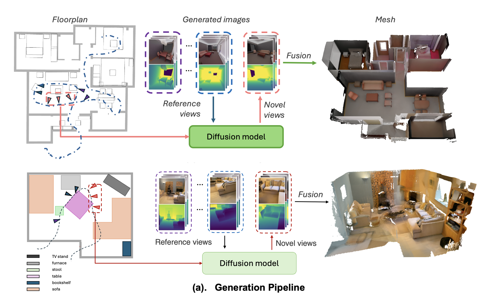

# HouseCrafter: Lifting Floorplans to 3D Scenes with 2D Diffusion Model

<div align="center">

[](https://neu-vi.github.io/houseCrafter/)
[](https://arxiv.org/abs/2406.20077)
[](LICENSE)

</div>

<p align="center">
  
</p>

## 📰 News

- **[2025/10]** Code and pre-trained models released!

## 📖 Abstract

Official PyTorch implementation for **HouseCrafter**, a novel approach for generating 3D indoor scenes from 2D floorplan layouts using diffusion models. Our method generates high-quality RGBD images from multiple viewpoints and fuses them into coherent 3D scene representations.

🌐 **Project Page**: [https://neu-vi.github.io/houseCrafter/](https://neu-vi.github.io/houseCrafter/)

## 🛠️ Installation

### Prerequisites

- Linux (tested on Ubuntu 18.04+)
- Python 3.10
- CUDA 11.8+ (for GPU acceleration)
- GPU with at least 24GB VRAM (recommended)

### Environment Setup

1. Clone the repository:
```bash
git clone https://github.com/YOUR_USERNAME/HouseCrafter.git
cd HouseCrafter
```

2. Create conda environment from the provided configuration:
```bash
conda env create -f environment.yml
conda activate housecrafter
```

That's it! The environment is ready to use.

## 📦 Download Checkpoints and Data

### Pre-trained Models

Download the pre-trained model checkpoints from the following link and place them in the `ckpts/` folder:

🔗 **Checkpoints**: [Download Link](https://drive.google.com/drive/folders/1OY_V9nV5kOfGLa6oSlZMzVp0vRst2g3Y?usp=sharing)

Expected directory structure:
```
ckpts/
├── 3dfront_layout_iodepth_1871_scene_3m/
│   ├── image_encoder/
│   ├── scheduler/
│   ├── unet/
│   ├── vae/
│   └── model_index.json
└── vae-ft-mse-840000-ema-pruned.ckpt
```

### Sample Data

Download the sample data from the following link and place them in the `dataRelease/` folder:

🔗 **Sample Data**: [data subsamples](https://drive.google.com/drive/folders/18p5m_RN5O9zDNe80ertQJPjEDTqAqTM-?usp=drive_link)

A subset of datasample is provided in the link above in the format required for inference.

Expected directory structure:
```
dataRelease/
├── layout_samples/
├── rendered_floor_sample/
├── graph_poses_all/
└── wall_info_all/
```

## 🚀 Quick Start

### Step 1: Generate RGBD Samples

Run the following command to generate multi-view RGBD images from floorplan layouts:

```bash
bash generate.sh
```

This script will generate RGBD images and save them to `gen_rgbd/`

### Step 2: Merge into 3D Model

After generating RGBD samples, merge them into a complete 3D scene:

```bash
bash rgbd_merging.sh
```

This script will:
- Process the generated RGBD data from `gen_rgbd/`
- Fuse multi-view images into 3D representations
- Output final 3D models to `generated_data_v0/`

### Visualizing Results

The generated 3D scenes will be saved in `generated_data_v0/`. Each scene contains:
- `colors/`: RGB images
- `depth/`: Depth maps
- `cam_Ts/`: Camera transformations
- Point cloud data for 3D reconstruction

## 📂 Project Structure

```
HouseCrafter/
├── src/                          # Source code
│   ├── generate_scene.py         # Main generation script
│   ├── data_modules/             # Data loading utilities
│   ├── diffusers/                # Diffusion model components
│   └── configs/                  # Configuration files
├── recon_utils/                  # 3D reconstruction utilities
│   ├── get_gen_data.py          # Extract generated data
│   ├── fuse_gen_data.py         # Fuse RGBD into 3D
│   └── denoise.py               # Post-processing
├── ckpts/                        # Model checkpoints (download required)
├── dataRelease/                  # Sample data (download required)
├── gen_rgbd/                     # Generated RGBD output
├── generated_data_v0/            # Final 3D scenes
├── generate.sh                   # RGBD generation script
├── rgbd_merging.sh              # 3D fusion script
└── README.md                     # This file
```

## 📊 Data Preprocessing

To prepare your own training data from the 3D-Front dataset, follow these steps:

### Step 1: Download 3D-Front Dataset

Download the 3D-Front dataset from Hugging Face:

🔗 **Dataset**: [https://huggingface.co/datasets/huanngzh/3D-Front](https://huggingface.co/datasets/huanngzh/3D-Front/tree/main)

The dataset contains:
- `3D-FRONT-SCENE.partaa` - `3D-FRONT-SCENE.partam` (Scene files, ~517 GB total)
- `3D-FRONT-SURFACE.partaa` - `3D-FRONT-SURFACE.partay` (Surface textures, ~1.07 TB total)
- `3D-FRONT-RENDER.tar.gz` (Pre-rendered images, 35.7 GB)

```bash
# Install Hugging Face CLI (if not already installed)
pip install huggingface-hub[cli]

# Download the dataset (choose the files you need)
huggingface-cli download huanngzh/3D-Front --repo-type dataset --local-dir ./3D-Front-Data
```

After downloading, extract the split archives:

```bash
# Combine and extract scene files
cat 3D-FRONT-SCENE.part* > 3D-FRONT-SCENE.tar.gz
tar -xzf 3D-FRONT-SCENE.tar.gz

# Combine and extract surface files
cat 3D-FRONT-SURFACE.part* > 3D-FRONT-SURFACE.tar.gz
tar -xzf 3D-FRONT-SURFACE.tar.gz
```

### Step 2: Set Up BlenderProc Environment

Set up the BlenderProc environment for rendering following the official guide:

🔗 **BlenderProc-3DFront**: [https://github.com/yinyunie/BlenderProc-3DFront](https://github.com/yinyunie/BlenderProc-3DFront)

```bash
cd BlenderProc-3DFront

# Install Blender and BlenderProc dependencies
pip install blenderproc

# Download CC textures (for improved materials)
python scripts/download_cc_textures.py

# Create symbolic links to your 3D-Front data
ln -s /path/to/3D-FRONT examples/datasets/front_3d_with_improved_mat/3D-FRONT
ln -s /path/to/3D-FUTURE-model examples/datasets/front_3d_with_improved_mat/3D-FUTURE-model
ln -s /path/to/3D-FRONT-texture examples/datasets/front_3d_with_improved_mat/3D-FRONT-texture
```

### Step 3: Render Training Data

Execute the rendering script to generate RGB images, depth maps, and layout information:

```bash
cd BlenderProc-3DFront/examples/datasets/front_3d_with_improved_mat

python examples/datasets/front_3d_with_improved_mat/renders_img_layout.py \
  /path/to/3DFrontData/3D-FRONT \
  /path/to/3DFrontData/3D-FUTURE-model \
  /path/to/3DFrontData/3D-FRONT-texture \
  ./resources/cctextures/ \
  /path/to/3DFrontDataRendering/images_3000scenes_random_floor \
  /path/to/3DFrontDataRendering/layout_pcd_3000scenes_random_floor \ 
  --poses_folder /path/to/3DFrontDataRendering/poses_all \
  --layout_folder /path/to/3DFrontDataRendering/layouts \
  --image_error_folder /path/to/3DFrontDataRendering/images_3000scenes_random_floor_error \
  --layout_error_folder /path/to/3DFrontDataRendering/layout_pcd_3000scenes_random_floor_error \
  --start 0 \
  --end 3000 \
  --step 24 \
  --gpu_id 0 \
  --offset 0
```

### Step 4: Render Layout Conditions for Inference Only (Optional)

If you only need to render layout conditions for inference without full scene rendering, you can use the standalone layout rendering script with either the 3D-FRONT dataset or your self-edited layout JSON files:

```bash
cd BlenderProc-3DFront/examples/datasets/front_3d_with_improved_mat

python render_layout.py \
  --input_path /path/to/3D-FRONT \
  --output_path /path/to/output/layouts \
  --scene_ids scene1,scene2,scene3
```

### Optional: Visualize Rendered Data

After rendering, you can visualize the results in 2D and 3D:

```bash
cd BlenderProc-3DFront
python visualization/front3d/vis_front3d.py --json_file YOUR_SCENE.json
```

For more details on customizing the rendering pipeline, refer to the [BlenderProc-3DFront documentation](https://github.com/yinyunie/BlenderProc-3DFront).

## 🎓 Model Training

After completing the data preprocessing steps described above, you can train the model using the provided training script:

```bash
bash test_train_original_layout_curate.sh
```

Make sure you have:
- Completed all data preprocessing steps
- Set up the correct path to rendered data in the config files
- Configured GPU resources (>= 48GB VRAM recommended)

## 📝 Citation

If you find this work useful for your research, please consider citing:

```bibtex
@misc{nguyen2025housecrafterliftingfloorplans3d,
      title={HouseCrafter: Lifting Floorplans to 3D Scenes with 2D Diffusion Model}, 
      author={Hieu T. Nguyen and Yiwen Chen and Vikram Voleti and Varun Jampani and Huaizu Jiang},
      year={2025},
      eprint={2406.20077},
      archivePrefix={arXiv},
      primaryClass={cs.CV},
      url={https://arxiv.org/abs/2406.20077}, 
}
```

## 🙏 Acknowledgments

This project is built upon several excellent open-source projects:
- [Stable Diffusion](https://github.com/Stability-AI/stablediffusion)
- [Diffusers](https://github.com/huggingface/diffusers)
- [3D-Front Dataset](https://tianchi.aliyun.com/specials/promotion/alibaba-3d-scene-dataset)
- [eschernet](https://github.com/kxhit/EscherNet)

We thank the authors for their amazing work!

## 📄 License

This project is licensed under the MIT License - see the [LICENSE](LICENSE) file for details.

## 📧 Contact

For questions and feedback, please contact:
- **Author**: [Yiwen Chen]
- **Email**: chen.yiwe@northeastern.edu
- **Project Issues**: [GitHub Issues](https://github.com/YOUR_USERNAME/HouseCrafter/issues)

---

<p align="center">
  ⭐ If you find this project helpful, please consider giving it a star! ⭐
</p>

